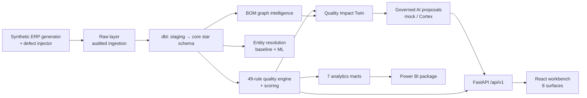

# BOM Guardian AI

**AI-Powered Supply Chain Data Quality and BOM Remediation Platform**

BOM Guardian AI detects supply-chain master-data and bill-of-materials defects across
simulated ERP source systems, resolves duplicate parts into explainable golden records,
computes each defect's downstream **blast radius** (the "Quality Impact Twin"), and
routes governed AI remediation proposals through a human-approval workflow — end to
end, reproducibly, on a laptop.

> **Business question answered:** which data defects create the greatest operational and
> financial risk, what is the most likely correction, what evidence supports it, and
> what downstream entities would be affected?

## Implementation status (honest)

| Capability | Status |
|---|---|
| Synthetic ERP generator (22 datasets, smoke/demo/full profiles) | Implemented and tested |
| Controlled defect injection (25 types) with isolated ground truth | Implemented and tested |
| Auditable, idempotent ingestion → DuckDB local warehouse | Implemented and tested |
| dbt transformations (staging, core star schema, 7 marts) | Implemented and tested (local DuckDB target) |
| Data-quality engine — 49 rules, evidence, scoring | Implemented and tested (recall measured vs ground truth) |
| Entity resolution — weighted baseline + LR + gradient boosting | Implemented and tested (evaluation artifacts published) |
| Field-level golden-record survivorship with lineage | Implemented and tested |
| BOM graph intelligence (cycles, orphans, reverse deps, criticality) | Implemented and tested |
| Quality Impact Twin — blast radius + counterfactual simulation | Implemented and tested (baseline immutability asserted) |
| Document intelligence with prompt-injection controls | Implemented and tested |
| Governed AI remediation engine (mock provider) | Implemented and tested |
| Snowflake Cortex AI provider | Implemented — **external validation pending (no credentials)** |
| FastAPI service (25 endpoints) | Implemented and tested |
| React remediation workbench (8 surfaces, live API data) | Implemented and tested; verified in-browser |
| Data Steward Copilot (read-only, cited) | Implemented and tested |
| Snowflake warehouse scripts | Authored — **deployment pending (no credentials)** |
| Power BI package (marts, model spec, DAX, theme, pages) | Source package complete — **Desktop validation pending; no `.pbix` exists** |
| CI (GitHub Actions), secret scanning, threat model | Implemented (see Actions run history for live status) |
| End-to-end test + published evaluation artifacts | Implemented and measured |

## Measured results (reproducible, synthetic data, seed 20260716)

| Metric | Result | Source |
|---|---|---|
| Detection recall vs 156 injected labeled defects (17 mapped types) | **100%** | [`evaluation/data_quality/detection_smoke.json`](evaluation/data_quality/detection_smoke.json) · `python scripts/evaluate_detection.py` |
| ER baseline (recommend band) | P = 1.00, R = 0.57 | [`evaluation/entity_resolution/baseline_smoke.json`](evaluation/entity_resolution/baseline_smoke.json) |
| ER gradient boosting (held-out test split) | P = 1.00, R = 1.00 *(≈6 positives — wide uncertainty, see model card)* | [`evaluation/entity_resolution/ml_smoke.json`](evaluation/entity_resolution/ml_smoke.json) |
| Generated records — smoke / demo / full | 13,882 / 247,881 / **1,699,010** | [`evaluation/performance/profile_counts.json`](evaluation/performance/profile_counts.json) |
| 49 rules over demo profile (248k records) | 0.9 s | [`evaluation/performance/benchmarks_demo.json`](evaluation/performance/benchmarks_demo.json) |
| API list endpoints | ~10 ms | same |
| Automated tests | **136 Python + 5 frontend, all passing** | `pytest`, `npm test` |

Full-profile numbers cover generation only; downstream stages ran at smoke/demo scale
(see [docs/limitations.md](docs/limitations.md)).

## The differentiator — Quality Impact Twin

Most DQ tools count defects. BOM Guardian ranks them by consequence: for every issue it
walks the BOM graph and computes affected assemblies, exposed future demand, inventory
and open-PO value at risk, supplier concentration, and an operational priority — then
lets a steward **simulate** the fix (merge / field correction / component replacement)
and see resolved rules and newly introduced conflicts *before* approving. Simulations
are persisted separately and never mutate baseline data (asserted by tests).

## Architecture



Details: [docs/architecture/overview.md](docs/architecture/overview.md) ·
[docs/diagrams/erd.md](docs/diagrams/erd.md) ·
[docs/architecture-decisions.md](docs/architecture-decisions.md)

## Screenshots

Not included: automated screenshot capture wasn't possible in the build environment,
and this project doesn't fabricate outputs. The UI was verified live (Command Center
KPIs, issue workbench, AI recommendation, approval audit) — run the 10-minute
[demo script](docs/demo-script.md) to see it.

## Quickstart (no cloud account needed)

```bash
git clone https://github.com/Darshita-dp/AI-Powered-Supply-Chain-Data-Quality-and-BOM-Remediation-Platform.git
cd AI-Powered-Supply-Chain-Data-Quality-and-BOM-Remediation-Platform
python -m venv .venv && . .venv/Scripts/activate     # Windows Git Bash
pip install -e ".[dev,api,ml,dbt]"

python scripts/run_local_pipeline.py                 # generate → inject → ingest → dbt → rules → marts
uvicorn api.app.main:app --port 8000                 # API (terminal 1)
cd frontend && npm install && npm run dev            # UI  (terminal 2) → http://localhost:5173

pytest                                                # 136 tests
```

Evaluation artifacts regenerate with `scripts/evaluate_detection.py`,
`scripts/evaluate_entity_resolution.py`, `scripts/train_entity_resolution.py`,
`scripts/benchmark.py`.

Snowflake is the target warehouse (scripts in [`warehouse/snowflake/`](warehouse/snowflake/),
dbt `snowflake` target, role model, Cortex provider) — deployment requires an account
and is honestly marked pending throughout.

## Documentation

| | |
|---|---|
| [Business case](docs/business-case.md) | Why master-data defects matter and who benefits |
| [Data dictionary](docs/data-dictionary.md) | Every layer and table |
| [DQ rule catalog](docs/dq-rule-catalog.md) | Rule taxonomy (registry in code is source of truth) |
| [API guide](docs/api-guide.md) | All 25 endpoints |
| [Model card](docs/model-card.md) | ER models, metrics, caveats |
| [AI governance](docs/ai-governance.md) | Hard guarantees: no AI mutation, grounding, abstention, audit |
| [Security model](docs/security-model.md) | Controls + 10-risk threat model + honest gaps |
| [Limitations](docs/limitations.md) | What this project does **not** prove |
| [Demo script](docs/demo-script.md) | 10-minute walkthrough |
| [Power BI build kit](powerbi/BUILD_POWER_BI.md) | Semantic model, DAX, pages, honest status |

## Technology

Python 3.12+ · DuckDB (local) / Snowflake (target) · dbt · scikit-learn · NetworkX ·
FastAPI · Pydantic · React 19 + TypeScript + Vite + TanStack Query + Cytoscape.js ·
Power BI (spec) · GitHub Actions · structlog.

## Synthetic-data disclaimer

Every part, supplier, price, and document in this repository is synthetically generated.
No real company, supplier, or personal data is used anywhere, and all quality metrics
are measured against injected, labeled defects.

## License

[MIT](LICENSE)
