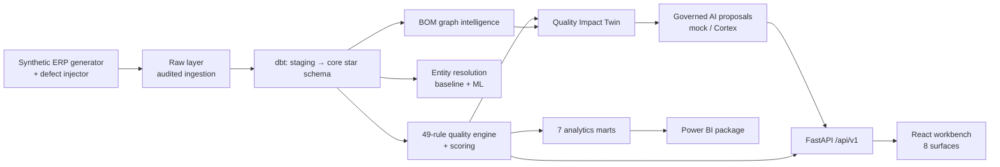
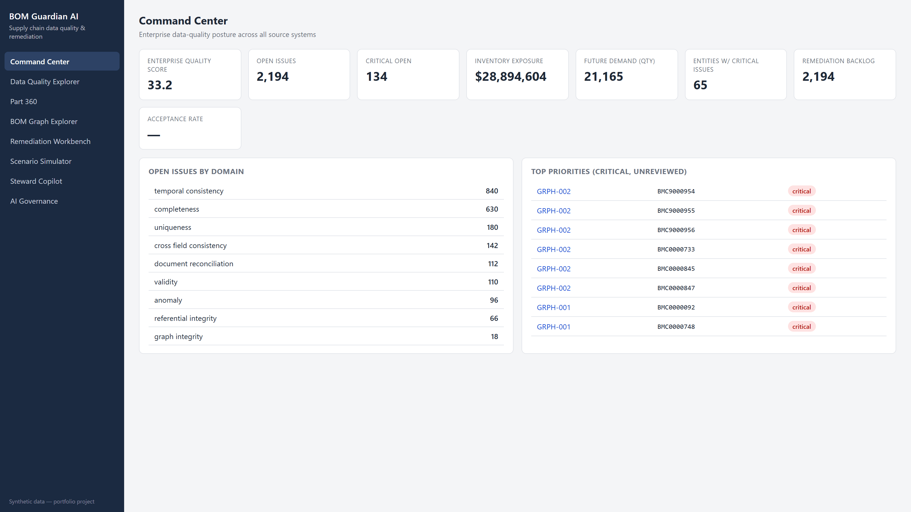
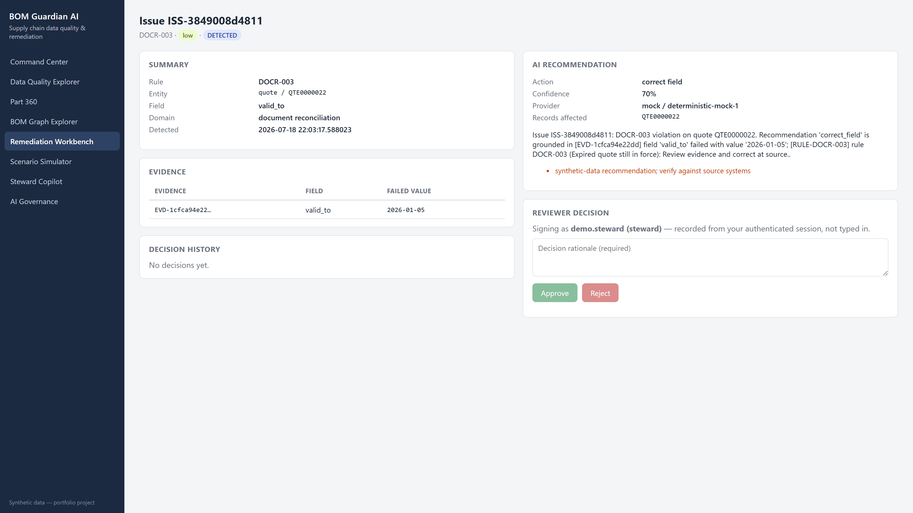
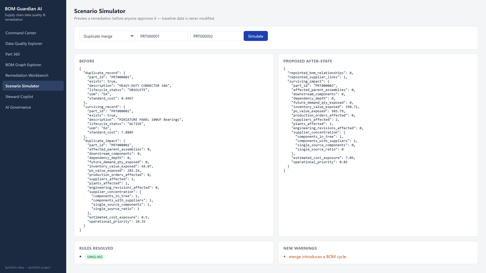
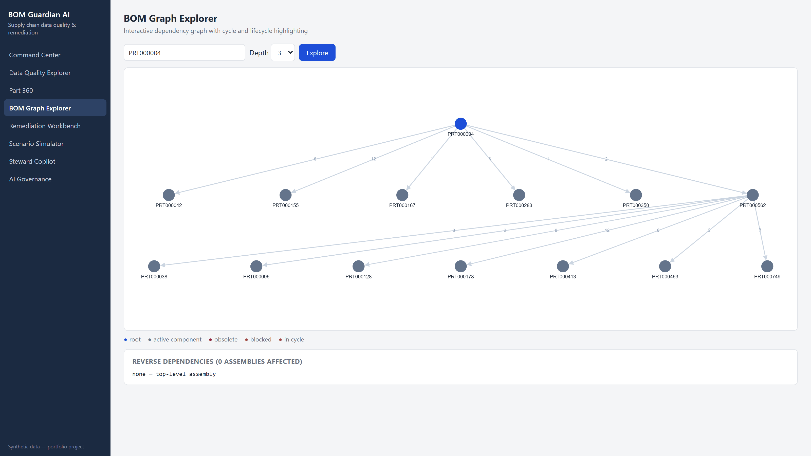

# BOM Guardian AI

[](https://github.com/Darshita-dp/AI-Powered-Supply-Chain-Data-Quality-and-BOM-Remediation-Platform/actions/workflows/ci.yml)

**AI-Powered Supply Chain Data Quality and BOM Remediation Platform**

BOM Guardian AI detects supply-chain master-data and bill-of-materials defects across
simulated ERP source systems, resolves duplicate parts into explainable golden records,
computes each defect's downstream **blast radius** (the "Quality Impact Twin"), and
routes governed AI remediation proposals through a human-approval workflow — end to
end, reproducibly, on a laptop.

> **Business question answered:** which data defects create the greatest operational and
> financial risk, what is the most likely correction, what evidence supports it, and
> what downstream entities would be affected?

## Implementation status (honest)

| Capability | Status |
|---|---|
| Synthetic ERP generator (22 datasets, smoke/demo/full profiles) | Implemented and tested |
| Controlled defect injection (25 types) with isolated ground truth | Implemented and tested |
| Auditable, idempotent ingestion → DuckDB local warehouse | Implemented and tested |
| dbt transformations (staging, core star schema, 7 marts) | Implemented and tested (local DuckDB target) |
| Data-quality engine — 49 rules, evidence, scoring | Implemented and tested (precision + recall by subsystem/difficulty vs a validated clean baseline) |
| Entity resolution — weighted baseline + LR + gradient boosting | Implemented and tested (evaluation artifacts published) |
| Field-level golden-record survivorship with lineage | Implemented and tested |
| BOM graph intelligence (cycles, orphans, reverse deps, criticality) | Implemented and tested |
| Quality Impact Twin — blast radius + counterfactual simulation | Implemented and tested (baseline immutability asserted) |
| Document intelligence with prompt-injection controls | Implemented and tested |
| Governed AI remediation engine (mock provider) | Implemented and tested |
| Snowflake warehouse adapter + Cortex `AI_COMPLETE` provider | Implemented locally, fake-connection tested — **external Snowflake execution pending (no credentials)** |
| Configurable real AI provider (Anthropic Claude) | Implemented, fake-client tested — **external validation pending (`scripts/validate_real_ai_provider.py` needs a key)** |
| FastAPI service (29 endpoints) | Implemented and tested |
| Role-based authorization (analyst/steward/admin; steward-gated decisions; authenticated actor recorded) | Implemented and tested — **demonstration auth (static demo tokens), not enterprise SSO/OIDC** |
| React remediation workbench (8 surfaces, live API data) | Implemented and tested (5 vitest tests, typecheck/build clean); **real Playwright screenshots of all 8 surfaces captured** from the running app ([`docs/screenshots/`](docs/screenshots/)) |
| Data Steward Copilot (read-only, cited) | Implemented and tested |
| Snowflake warehouse scripts + adapter + deploy path | Implemented locally (`SnowflakeWarehouse`, `scripts/deploy_snowflake.py`) — **deployment pending (no credentials)** |
| Power BI package (marts, model spec, DAX, theme, pages) | Source package complete — **Desktop validation pending; no `.pbix` exists** |
| CI (GitHub Actions), secret scanning, threat model | Implemented and **verified green on GitHub** (latest run [29672365390](https://github.com/Darshita-dp/AI-Powered-Supply-Chain-Data-Quality-and-BOM-Remediation-Platform/actions/runs/29672365390): python 3.12 + 3.13, frontend, dbt, docs-links, secrets) |
| End-to-end test + published evaluation artifacts | Implemented and measured |

## Measured results (reproducible, synthetic data, seed 20260716)

| Metric | Result | Source |
|---|---|---|
| Defect detection vs a **validated clean baseline** (20 SQL-detectable types) | **recall 0.985 (194/197), precision ≥ 0.933** (conservative; per difficulty + subsystem) | [`detection_smoke.json`](evaluation/data_quality/detection_smoke.json), [`clean_baseline_smoke.json`](evaluation/data_quality/clean_baseline_smoke.json) · `scripts/evaluate_detection.py` |
| ER — candidate-generation recall (blocking) | 0.95 over 409 labeled duplicate pairs | [`evaluation/entity_resolution/ml_eval.json`](evaluation/entity_resolution/ml_eval.json) |
| ER — logistic regression (entity-disjoint, 5 seeds) | **P 0.962 ± 0.010, R 0.804 ± 0.178, F1 0.867 ± 0.113** | same · [model card](docs/model-card.md) |
| ER — gradient boosting (entity-disjoint, 5 seeds) | P 0.769 ± 0.431, R 0.471 ± 0.375 — high-variance, not recommended at this scale | same |
| Generated records — smoke / demo / full | 13,882 / 247,881 / **1,699,010** | [`evaluation/performance/profile_counts.json`](evaluation/performance/profile_counts.json) |
| 49 rules over demo profile (248k records) | 0.9 s | [`evaluation/performance/benchmarks_demo.json`](evaluation/performance/benchmarks_demo.json) |
| API list endpoints | ~10 ms | same |
| Automated tests | **182 Python (1 skipped) + 5 frontend, all passing** (incl. a true dbt-pipeline E2E and authorization enforcement) | `pytest`, `npm test` |

Full-profile numbers cover generation only; downstream stages ran at smoke/demo scale
(see [docs/limitations.md](docs/limitations.md)).

## The differentiator — Quality Impact Twin

Most DQ tools count defects. BOM Guardian ranks them by consequence: for every issue it
walks the BOM graph and computes affected assemblies, exposed future demand, inventory
and open-PO value at risk, supplier concentration, and an operational priority — then
lets a steward **simulate** the fix (merge / field correction / component replacement)
and see resolved rules and newly introduced conflicts *before* approving. Simulations
are persisted separately and never mutate baseline data (asserted by tests).

## Architecture



Details: [docs/architecture/overview.md](docs/architecture/overview.md) ·
[docs/diagrams/erd.md](docs/diagrams/erd.md) ·
[docs/architecture-decisions.md](docs/architecture-decisions.md)

## Screenshots

Real captures of the running application — no mockups. Each was taken by
[`scripts/capture_screenshots.py`](scripts/capture_screenshots.py), which runs the actual
pipeline, starts FastAPI and the Vite dev server, signs in with the demo steward token,
and drives the live UI with Playwright. Reproduce with `make screenshots`. All eight
surfaces are in [`docs/screenshots/`](docs/screenshots/).



*Command Center — enterprise quality score, issues by domain, and the highest-exposure defects, all read from the live API.*



*Remediation Workbench — evidence, a governed AI proposal (schema-validated, grounded, human-review-required), and the steward decision panel. The reviewer is taken from the authenticated session, never typed in.*



*Scenario Simulator (Quality Impact Twin) — a counterfactual merge with before/after state, rules resolved, and newly introduced conflicts (here: "merge introduces a BOM cycle"). Baseline data is never mutated.*



*BOM Graph Explorer — multi-level BOM traversal with cycle, orphan, and reverse-dependency analysis.*

Also captured: [Data Quality Explorer](docs/screenshots/issue-explorer.png) ·
[Part 360](docs/screenshots/part-360.png) ·
[AI Governance](docs/screenshots/ai-governance.png) ·
[Data Steward Copilot](docs/screenshots/copilot.png)

## Quickstart (no cloud account needed)

```bash
git clone https://github.com/Darshita-dp/AI-Powered-Supply-Chain-Data-Quality-and-BOM-Remediation-Platform.git
cd AI-Powered-Supply-Chain-Data-Quality-and-BOM-Remediation-Platform
python -m venv .venv && . .venv/Scripts/activate     # Windows Git Bash
pip install -e ".[dev,api,ml,dbt]"

python scripts/run_local_pipeline.py                 # generate → inject → ingest → dbt → rules → marts
uvicorn api.app.main:app --port 8000                 # API (terminal 1)
cd frontend && npm install && npm run dev            # UI  (terminal 2) → http://localhost:5173

pytest                                                # 182 tests (1 skipped)
```

Evaluation artifacts regenerate with `scripts/evaluate_detection.py`,
`scripts/evaluate_entity_resolution.py`, `scripts/train_entity_resolution.py`,
`scripts/benchmark.py`.

Snowflake is the target warehouse (scripts in [`warehouse/snowflake/`](warehouse/snowflake/),
dbt `snowflake` target, role model, Cortex provider) — deployment requires an account
and is honestly marked pending throughout.

## Documentation

| | |
|---|---|
| [Business case](docs/business-case.md) | Why master-data defects matter and who benefits |
| [Data dictionary](docs/data-dictionary.md) | Every layer and table |
| [DQ rule catalog](docs/dq-rule-catalog.md) | Rule taxonomy (registry in code is source of truth) |
| [API guide](docs/api-guide.md) | All 29 endpoints |
| [Model card](docs/model-card.md) | ER models, metrics, caveats |
| [AI governance](docs/ai-governance.md) | Hard guarantees: no AI mutation, grounding, abstention, audit |
| [Security model](docs/security-model.md) | Controls + 10-risk threat model + honest gaps |
| [Limitations](docs/limitations.md) | What this project does **not** prove |
| [Final verification report](docs/final-verification-report.md) | Forensic audit: what is CI-verified vs locally tested vs externally pending |
| [Demo script](docs/demo-script.md) | 10-minute walkthrough |
| [Power BI build kit](powerbi/BUILD_POWER_BI.md) | Semantic model, DAX, pages, honest status |

## Technology

Python 3.12+ · DuckDB (local) / Snowflake (target) · dbt · scikit-learn · NetworkX ·
FastAPI · Pydantic · React 19 + TypeScript + Vite + TanStack Query + Cytoscape.js ·
Power BI (spec) · GitHub Actions · structlog.

## Synthetic-data disclaimer

Every part, supplier, price, and document in this repository is synthetically generated.
No real company, supplier, or personal data is used anywhere, and all quality metrics
are measured against injected, labeled defects.

## License

[MIT](LICENSE)
