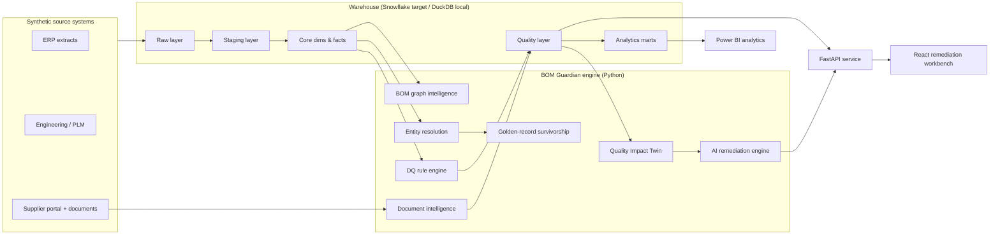

# Architecture Overview — BOM Guardian AI

## System context

## Layered warehouse

| Layer | Purpose | Key rules |
|---|---|---|
| **Raw** | Source data as received | Immutable; batch ID, timestamps, row/file hashes, schema version, load status |
| **Staging** | Standardization | Normalize casing, whitespace, part numbers, dates, currencies, UOM; originals preserved |
| **Core** | Conformed dims/facts | `dim_part`, `dim_supplier`, `dim_plant`, `dim_warehouse`, `dim_date`; facts for BOM, inventory, demand, POs, cost, lead time |
| **Quality** | DQ engine output | Rule definitions/executions/results, issues + evidence, quality scores, impact calcs, remediation queues |
| **Marts** | Analytics | Executive, part-master, BOM-integrity, supplier, business-impact, remediation-performance, AI-governance marts |

## Engine components (Python, `src/bom_guardian/`)

- **quality/** — configurable rule registry (40+ rules), executions, evidence, scoring
  at record / entity / BOM / enterprise level.
- **entity_resolution/** — blocking → similarity features → weighted baseline →
  LR / gradient-boosted classifiers → confidence bands (recommend / review / abstain).
  Precision-favored; never auto-merges.
- **golden_record/** — field-level survivorship with lineage, reason, confidence,
  alternatives; reversible.
- **bom_graph/** — NetworkX directed graph: cycles, orphans, depth, reverse
  dependencies, centrality, criticality.
- **impact_twin/** — blast-radius calculation and counterfactual scenario simulation;
  scenarios persisted separately, baseline never mutated.
- **document_intelligence/** — synthetic supplier PDFs, deterministic-first extraction,
  AI only for ambiguous fields, prompt-injection controls, ERP discrepancy issues.
- **ai/** — provider interface: `DeterministicMockAIProvider` (tests),
  `SnowflakeCortexAIProvider` (target), optional Anthropic. Schema-validated structured
  proposals, grounded explanations, abstention. No write access to golden state.
- **remediation/ + governance/** — issue lifecycle
  `DETECTED → … → PENDING_REVIEW → APPROVED/REJECTED → SIMULATED → VALIDATED → CLOSED`,
  full audit capture, feedback loop reporting.
- **observability/** — structured JSON logging, correlation IDs, AI-call governance
  fields (provider, model, prompt version, latency, cost estimate, validation result).

## Application tier

- **FastAPI** (`api/`) — versioned `/api/v1` routes for parts, issues, BOM graph,
  scenarios, analytics, copilot; pagination, filtering, structured errors, OpenAPI.
- **React + TypeScript** (`frontend/`) — Command Center, DQ Explorer, Issue Detail,
  Part 360, BOM Graph Explorer, Remediation Workbench, Scenario Simulator, AI
  Governance. Real API data only.
- **Power BI** (`powerbi/`) — source-controlled semantic model spec, DAX catalog, theme,
  page specifications; honest validation status depending on Desktop availability.

## Local-first execution

Everything runs without Snowflake: DuckDB warehouse, dbt local target, mock AI provider,
synthetic documents. Snowflake scripts live in `warehouse/snowflake/` and deployment
status is reported honestly in `PROJECT_STATUS.md`.
