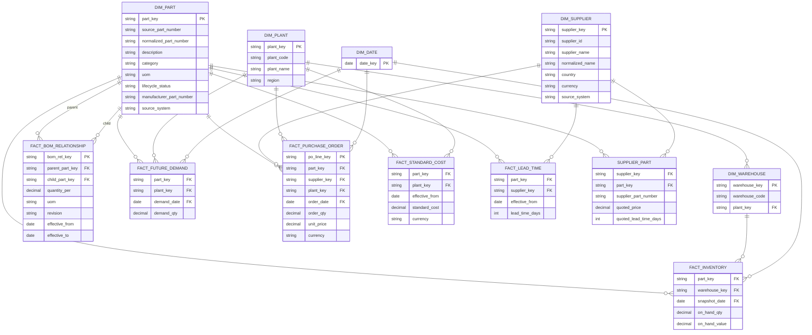
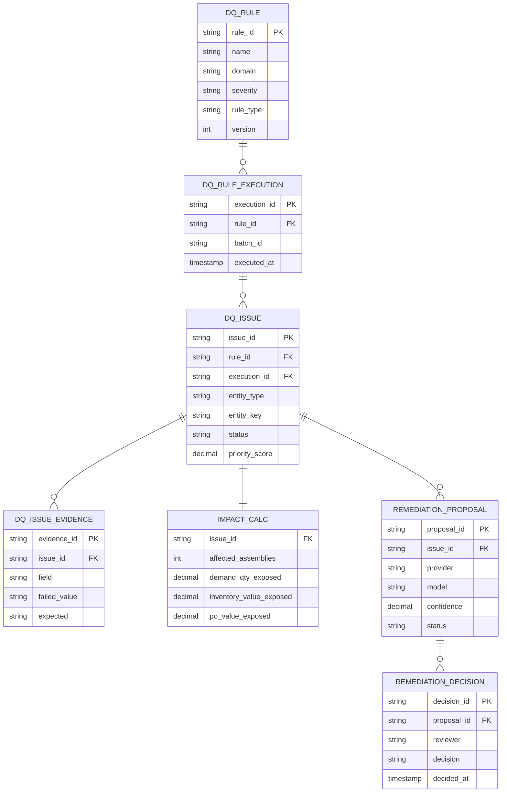

# ERD — Core Warehouse Model (target design)

Conformed core layer. Staging/raw carry the same grain plus audit columns; the quality
layer references core keys. This is the design target; column lists abbreviate to key
fields.

## Quality layer (design target)

